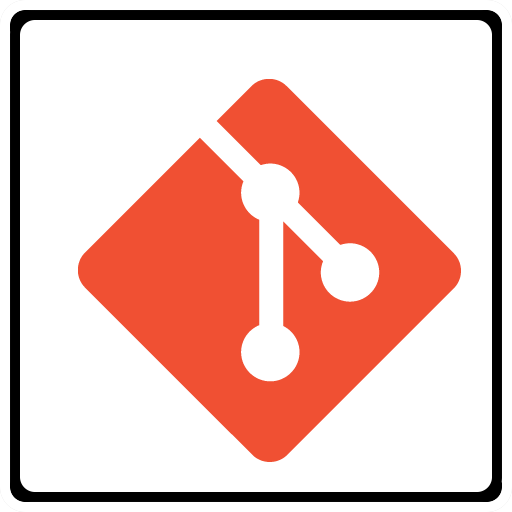
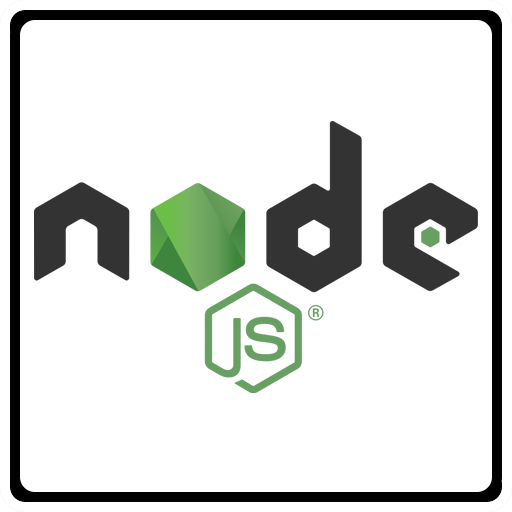
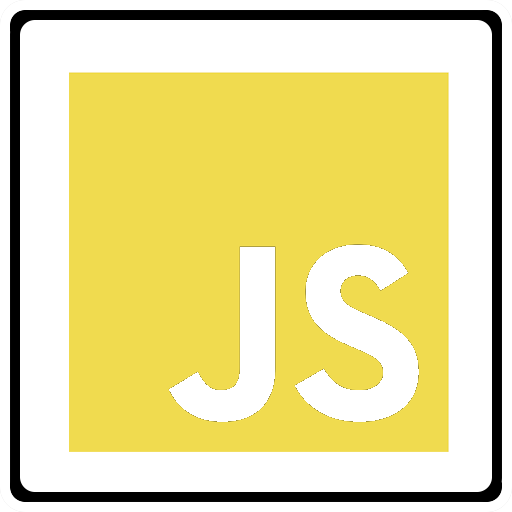
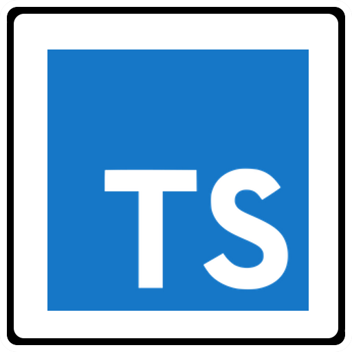
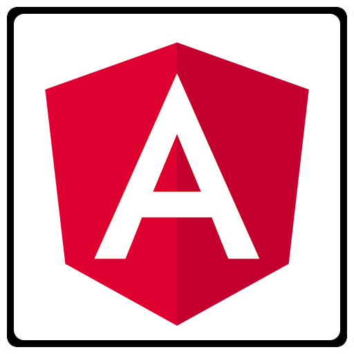
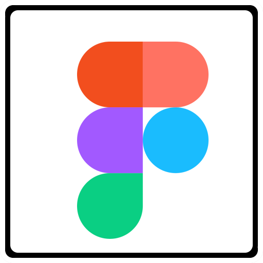
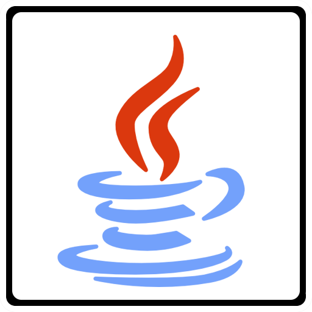
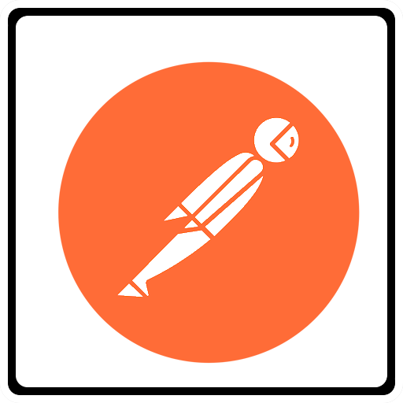
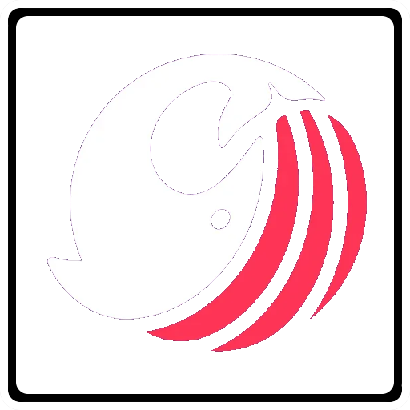
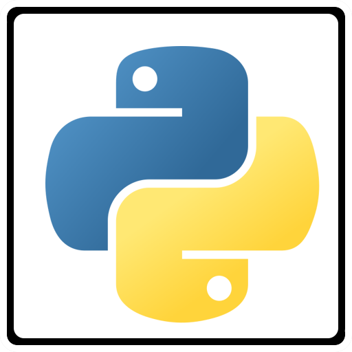

<h1 align="center">Hey 👋, I'm Marco Zuliani Escalante</h1>

<h2>About Me</h2>

- I'm a Software Engineering Student at Universidad de los Andes, currently doing an internship at [Caseware](https://www.linkedin.com/company/caseware-international-inc/mycompany/) as a Software Developer.

- I am starting to expand my knowledge in infrastructure and automation. I believe this will enable me to develop more comprehensive solutions that cover a wider range of fields.

- As you may have seen, I like wolves not only for their appearance but also for their meaning of unity and loyalty.

<h3>Connect with me:</h3>
 

<h2>Tech Stack and Tools</h2>
          

          

<h2>GitHub Stats</h2>

